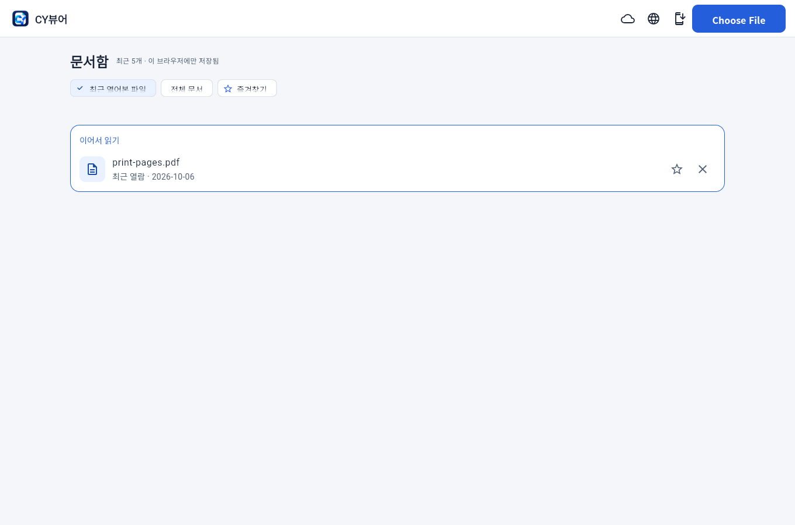
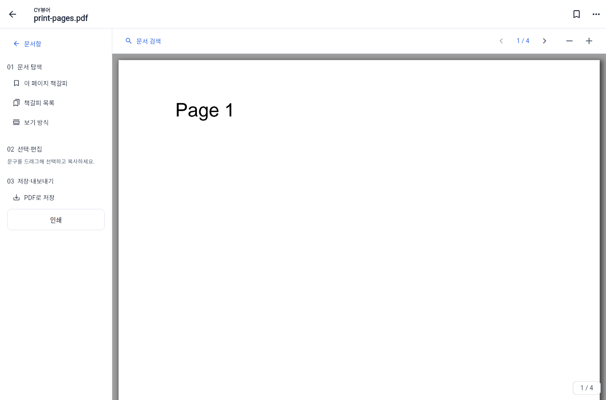
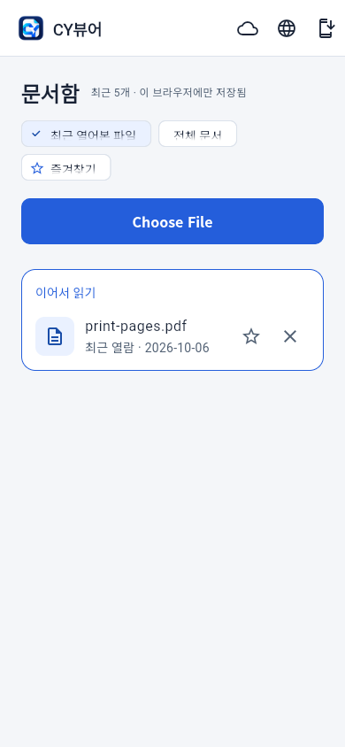

# 문서함과 리더 디자인 정리

2026-10-06 사용자의 디자인 개선 요청에 따라 시작 화면의 큰 소개를 줄이고, 최근 문서와 읽기 도구를 중심으로 화면을 정리했다.

- Mac·웹·Windows의 빈 상태를 간결한 파일 열기 카드로 바꿨다. 최근 문서의 첫 항목과 Drive 홈에 ‘이어서 읽기’를 표시한다. 실제 파일명·페이지·날짜·즐겨찾기·제거 동작을 보존한다.
- 웹 문서함을 세로 중앙에서 상단으로 옮겼다. Mac·Windows와 같은 문서함 흐름을 사용한다.
- 데스크톱 리더의 검색·페이지 이동·확대를 상단 도구막대에 모았다. 책갈피 목록과 보기 방식은 별도 행동으로 분리했다. 보조 행동의 반복적인 테두리를 줄였다. Windows는 좁은 창에서 문서 도구 패널을 펼쳤을 때 상단 도구를 두 행으로 배치해 버튼이 잘리지 않게 했다.
- 웹 인쇄·파일 선택의 실제 HTML 입력 경로, Mac 파일 접근 권한, OCR·저장·Drive 동기화 처리는 유지한다. 작은 화면과 큰 글자에서는 기존 문서 도구 메뉴를 사용한다.
- 소스 버전은 Mac/웹 `1.11.0+17`, Windows `1.8.0`이다. 웹 부트스트랩과 앱 코드의 캐시 식별자도 함께 갱신했다.

디자인 기준과 선택 근거는 [디자인 시스템](CY_DESIGN_SYSTEM.md)의 2026-10-06 항목에 기록했다. Refero 온라인 스타일 조회는 구독 제한으로 실패했으며, 기존 제품과 내장 typography·craft-details 기준을 사용했다.

## 로컬 검증

- Flutter 분석: 문제 없음.
- Flutter 전체 검사: 52개 통과, PDFium 공유 라이브러리를 요구하는 실제 엔진 검사 1개는 기존 설정에 따라 건너뜀.
- Windows Python 단위 검사: 18개 통과. Linux에서 Tk 런타임을 별도 임시 경로로 제공해 실행했으며 Windows GUI 검증으로 간주하지 않는다.
- 웹 다운로드·IndexedDB 검사: 5개 통과.
- 웹 릴리스 빌드 성공. Wasm 실험 빌드 검사는 제외하고 실제 배포 대상인 JavaScript 빌드를 확인했다.
- Chrome에서 실제 `print-pages.pdf` 4쪽 파일을 파일 입력으로 열어 렌더링하고, 뒤로 돌아간 최근 문서 목록과 390px 화면을 확인했다. 페이지 스크립트 오류 없음. 실제 상단 다음 페이지 버튼, 독립 보기 방식 선택과 책갈피 목록 진입도 확인했다.
- 배포 시작 스크립트: 새 버전 두 플랫폼 실행, 버전 미변경 시 실행 안 함, 공개 릴리스 재실행 안 함, 충돌 태그 변경 거부를 모의 Git/CLI로 검사했다.
- Mac Swift 업데이트 검사는 로컬에 Swift가 없어 실행하지 못했다. Mac·Windows 전체 빌드·설치는 기존 GitHub Actions에서 검사한다. iPhone/iPad 실기기·AirPrint·실제 Google 권한 동의는 이 로컬 검증 범위에 포함되지 않는다.

## 실제 웹앱 화면

아래 이미지는 수정한 웹 릴리스 빌드를 로컬 Chrome에서 실행한 화면이다. 빈 화면 또는 저장소의 실제 PDF 검사 파일을 사용하며, Mac/Windows 실행 화면을 대신하지 않는다. 기본 파일 선택 버튼의 문구는 브라우저 언어를 따른다.

## 배포

`publish-desktop-versions.yml`은 main의 버전 변경을 플랫폼 태그 및 기존 OS별 검증·릴리스 빌드로 연결한다. GitHub 게시와 실제 설치 파일·체크섬 확인 결과는 배포가 끝난 뒤 별도로 기록한다.
