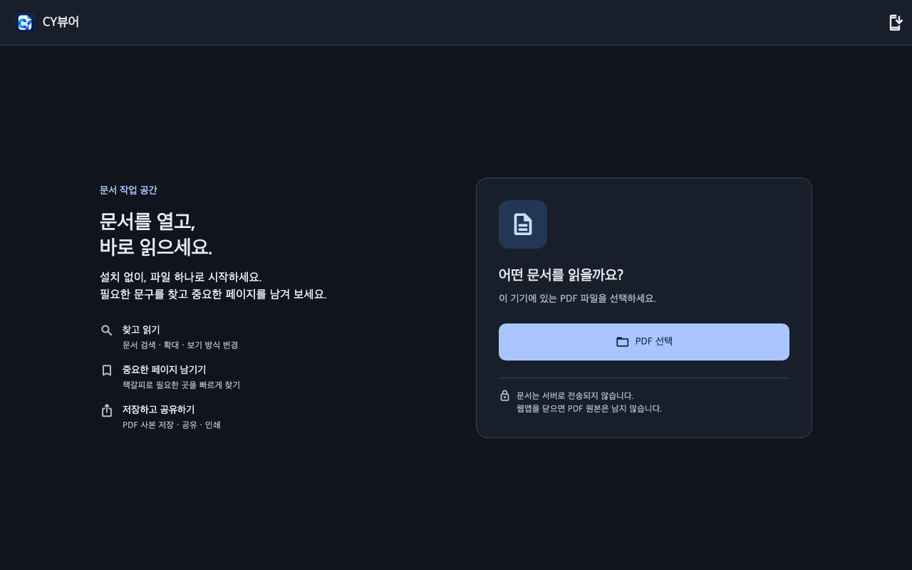
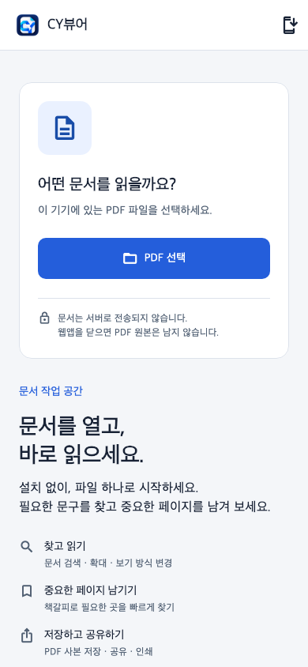
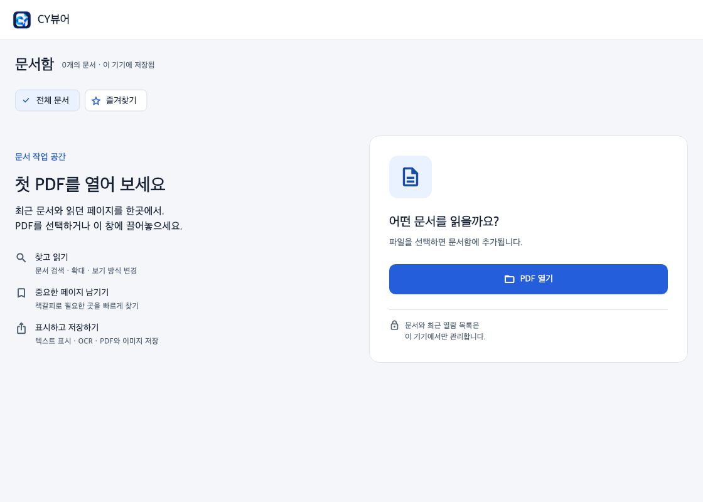

# 전 플랫폼 디자인 개선 검토

## 변경 내용

- Apple 앱과 웹앱의 표면·대비·글자·버튼을 공통 테마로 관리한다.
- 넓은 시작 화면은 기능 안내와 PDF 열기 영역을 구분한다. 모바일에서는 파일 열기가 먼저 나온다.
- 앱 문서함에 전체/즐겨찾기 탭, 문서 수, 읽던 페이지, 즐겨찾기 설명을 표시한다.
- 리더 창이 좁거나 글자가 크면 전체 도구를 메뉴에 모아 파일명과 검색 공간을 확보한다.
- Windows의 보기·검색 행을 분리하고, 왼쪽 도구를 스크롤할 수 있게 한다.
- Windows 버튼의 Tab 이동, Enter/Space 실행, 포커스 표시를 제공한다.
- 웹 파일 선택 입력의 네이티브 HTML 동작을 유지하면서 키보드 포커스를 표시한다.

근거와 색상 규칙은 [디자인 시스템](CY_DESIGN_SYSTEM.md)에 기록했다.
Refero 온라인 검색은 구독 비활성으로 실패했으며, 내장 typography/color/craft 가이드를 적용했다.

## 미리보기

아래 이미지는 실제 앱의 Flutter 위젯을 테스트 환경에서 렌더링한 결과다.
한국어 글꼴과 Material 아이콘을 주입했으며, OS나 브라우저의 실제 실행 스크린샷은 아니다.

### 웹 · 데스크톱 · 어두운 모드

### 웹 · 모바일 · 밝은 모드

### Apple 앱 · 문서함 · 밝은 모드

## 검증 결과와 남은 확인

- Flutter 분석 오류 없음.
- 기존 회귀 및 반응형 테스트 14개 통과. 320/1024 너비, 글자 1/2배,
  즐겨찾기 빈 상태에서 돌아오기, 파일 열기 버튼 접근성을 포함한다.
- 웹 릴리스 빌드와 macOS 릴리스 빌드 성공.
- Windows Python 구문 검사 통과.
- Windows 실제 실행과 iPhone 실제 기기 테스트는 수행하지 않았다.
- 새 웹앱의 실제 브라우저 검증은 Chrome 확장 프로그램 UI에 막혀 완료하지 못했다.
  macOS GUI 검증도 Mac 잠금 해제 후 확인이 필요하다.
- 미리보기에서 계층·대비·배치·모바일 스크롤을 검토했다. 배포 전 각 플랫폼에서
  PDF 열기, 문서 도구, 저장, 키보드 포커스를 직접 확인한다.

이번 변경은 디자인 검토용 브랜치이며 운영 웹앱과 설치 파일을 갱신하지 않는다.
